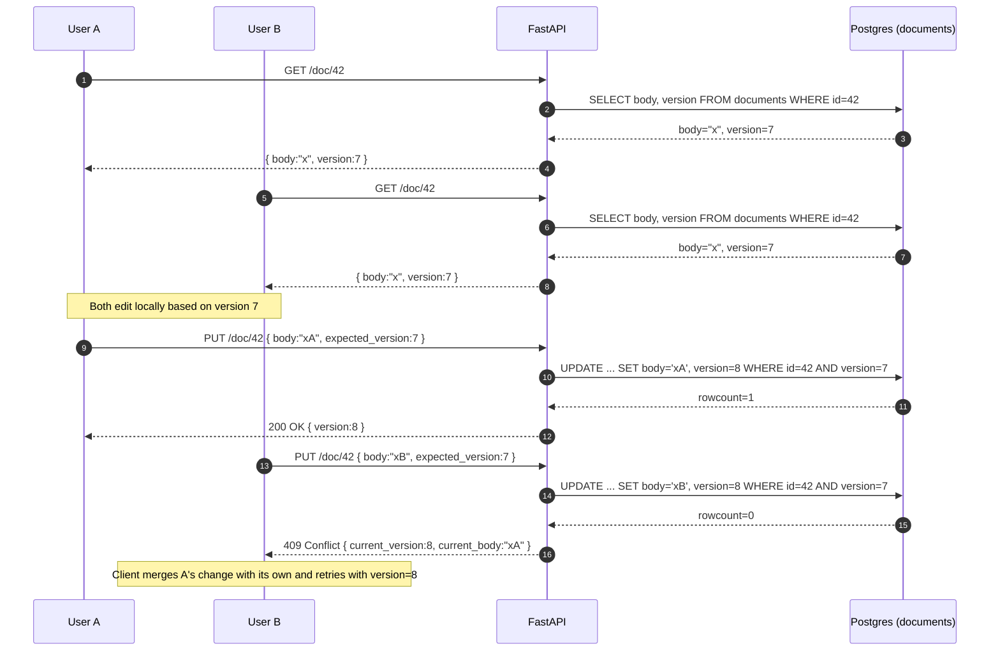

# Building Resilient Distributed Systems -- StudySync

**Course:** Parallel and Distributed Computing  
**Author:** Aqib Bin Qamar (BSCS23178)

---

## Part 1 -- Analysis

### 1.1 Synchronization: the Lost Update on shared documents

The naive flow is `GET /doc/:id` -> user edits in React -> `PUT /doc/:id`. The
backend executes the update with a single SQL statement
`UPDATE documents SET body = :new_body WHERE id = :id`, with no version
or timestamp predicate. When two users `GET` the same revision and both
`PUT` their edits, the second write unconditionally overwrites the
first. This is the textbook **Lost Update** anomaly: the database has no
information about which *revision* each client based its edit on, so it
cannot reject the stale write. SQLAlchemy session isolation does not
help here -- both updates commit successfully because each transaction is
internally consistent; the conflict is *between* transactions and lives
at the application layer.

### 1.2 Coordination: dropped Clerk webhook = permanent inconsistency

Clerk sends `subscription.deleted` over HTTP, fire-and-forget. The
backend handles it inline, mutates `users.is_premium = false`, and
returns 200. Three failure modes break this:

1. **Network blip**: Clerk's POST never reaches the backend; Clerk
   retries a few times, eventually gives up.
2. **Crash mid-handler**: row in `users` is updated but the response is
   never sent, so Clerk retries and the handler runs again. If the
   handler is non-idempotent (e.g. it also issues a refund), the side
   effect happens twice.
3. **Out-of-order delivery**: a later `subscription.created` is
   processed *before* the original `deleted`, leaving the user premium
   forever.

The root cause is that the system treats an *at-least-once* delivery
channel as if it were *exactly-once*, with no idempotency key, no
durable inbox, and no retry/DLQ pipeline. A single dropped event
permanently desyncs Clerk's state from our database -- Clerk thinks the
subscription is cancelled, we think it is active.

### 1.3 Fault Tolerance: synchronous LLM call as a single point of failure

The `/ai/tutor` endpoint calls an external LLM with a blocking
`requests.post(...)` (or even `await httpx.post` with no per-call
timeout). When the provider is degraded, the TCP connection just hangs
until OS-level keepalive expires -- typically ~60 seconds. Every Uvicorn
worker thread that hits this endpoint is stuck for that full window. With
N workers and >N concurrent requests, the worker pool is exhausted;
healthy endpoints (`/health`, `/auth`, anything) cannot get a worker
either, so the **whole app appears down even though only one downstream
is sick**. That is a classic *cascading failure* caused by treating an
unreliable remote call as if it were a local function.

---

## Part 2 -- Design

### 2.1 Sync -- Optimistic Locking with row version

Add a monotonic `version INTEGER NOT NULL` column to `documents`. Every
read returns `(body, version)`. Every write must send the version it was
based on:

```sql
UPDATE documents
SET    body = :new_body, version = version + 1
WHERE  id = :id AND version = :expected_version;
```

If `rowcount == 0` we return **HTTP 409 Conflict** with the current
revision so the client can three-way-merge or prompt the user. No
pessimistic locks, so reads and non-conflicting writes never block each
other. This is *single-document* OCC; for character-level co-editing we
would layer Operational Transformation or a CRDT on top, but OCC alone
already eliminates Lost Update.

#### UML Sequence Diagram -- two concurrent users



### 2.2 Coordination -- idempotent webhooks with a durable inbox + DLQ

1. **Idempotency key.** Persist Clerk's `event.id` in a unique-indexed
   `webhook_inbox` table *before* doing any business logic. If the
   insert violates the unique constraint, we have already processed
   this event -- return 200 immediately. This makes the handler safe
   against Clerk's at-least-once retries.
2. **Outbox pattern at the receiver.** The handler does two things in a
   single DB transaction: insert into `webhook_inbox` *and* write the
   intended state change as a row in a `pending_events` queue. A
   background worker drains `pending_events` and applies the side
   effect (e.g. flipping `is_premium`, issuing a refund). Because both
   writes are in the same ACID transaction, neither can happen without
   the other.
3. **Retries with exponential backoff.** The worker retries failed
   side-effects with backoff (e.g. 1 s, 5 s, 25 s, 2 min, 10 min). The
   API endpoint itself stays under 200 ms because all heavy work is
   deferred.
4. **Dead-letter queue.** After N retries the row is moved to
   `dead_letter_events` and a Slack/PagerDuty alert is fired. We never
   silently drop a cancellation; worst case it is paused for human
   review.
5. **Monotonic ordering.** Use Clerk's `event.created` timestamp (and
   the Svix signature for authenticity). When applying the effect we
   compare against `users.last_clerk_event_at` and discard events older
   than what we have already applied -- this fixes out-of-order
   `created`/`deleted`.

### 2.3 Fault Tolerance -- Circuit Breaker + Fallback for the LLM

Wrap every LLM call in a three-state breaker -- `CLOSED`, `OPEN`,
`HALF_OPEN` -- with a strict per-call timeout (e.g. 2 s, far below the
60 s upstream hang).

- **CLOSED** -- calls flow through; consecutive failures are counted.
- **OPEN** -- once `failure_threshold` is hit, every call is
  short-circuited and returns the fallback in microseconds. The sick
  upstream is given air to recover and our worker pool is no longer
  starved.
- **HALF_OPEN** -- after `recovery_timeout` seconds, exactly one probe
  call is allowed through. Success -> back to `CLOSED`. Failure ->
  back to `OPEN` for another window.

The **fallback** is the second half of the pattern: rather than
returning HTTP 500 we serve a degraded-but-correct response -- a cached
study tip, a stock answer, or the user's last successful completion --
and tag the response with `fallback: true` so the UI can show a banner
("Tutor is offline, here is a cached answer"). This is the implemented
fix in `app/circuit_breaker.py` and is exercised by `pytest -v`.

### 2.4 CAP trade-offs

CAP forces us to pick two of {Consistency, Availability,
Partition-tolerance}. In a real WAN we always have Partition-tolerance,
so the real choice each design makes is **C vs A** -- and once you fix
C/A you have a *third* axis to tune: latency.

| Sub-system          | Pattern                | C/A choice  | Why                                                                                                               |
|---------------------|------------------------|-------------|-------------------------------------------------------------------------------------------------------------------|
| Document edits      | Optimistic Locking     | **CP**      | A stale write is rejected (`409`) rather than silently accepted. We sacrifice availability of writes during a conflict to preserve correctness -- losing user work is unacceptable. |
| Webhook handling    | Idempotent inbox + DLQ | **AP, eventually consistent** | The API endpoint always returns 200 fast (Available), but the user's `is_premium` flag may lag the event by seconds-to-minutes while the worker drains. We accept brief inconsistency to never drop an event. |
| LLM tutor           | Circuit Breaker + fallback | **AP**  | The fallback answer is *not* the freshest LLM output, so we are explicitly trading Consistency-of-content for **Availability of the API**. Latency improves dramatically: a 60 s hang becomes a sub-millisecond fallback. |

The system is therefore deliberately **mixed-consistency**: strong
where data loss is unacceptable, eventually consistent elsewhere.
